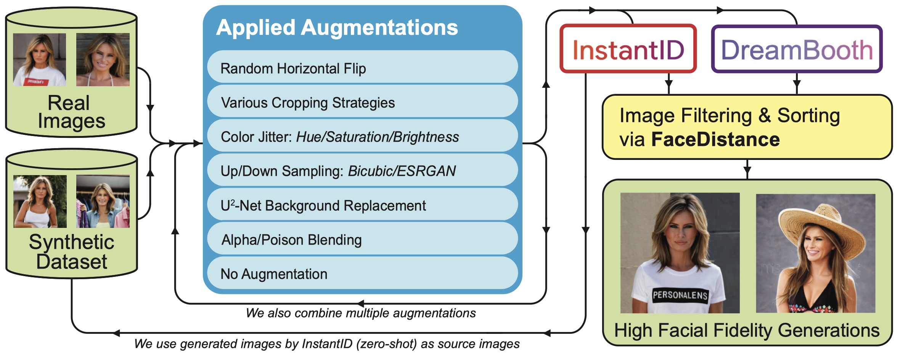

# Generating Synthetic Data via Augmentations for Improved Facial Resemblance in DreamBooth and InstantID

This repository contains the website source code for the research paper on synthetic face augmentation strategies.



📄 **arXiv**: [https://arxiv.org/abs/2505.03557](https://arxiv.org/abs/2505.03557)  
🏛️ **Conference**: Accepted to CVPR 2025 Workshop "Synthetic Data for Computer Vision Workshop", [this https URL](https://syndata4cv.github.io/)


## Citation

If you find the research paper useful, please cite:

```
@inproceedings{Ulusan2025SynData4CV,  
  author        = {Ulusan, Koray and Kiefer, Benjamin},
  title         = {{Generating Synthetic Data via Augmentations for Improved Facial Resemblance in DreamBooth and InstantID}},
  booktitle     = {Proceedings of the CVPR 2025 Workshop on Synthetic Data for Computer Vision (SynData4CV)},
  year          = {2025},
  month         = {May},
  url           = {https://openreview.net/forum?id=2o0RxrcV23},
  note          = {Accepted to the CVPR 2025 SynData4CV Workshop},
  eprint        = {2505.03557},
  archiveprefix = {arXiv},
  primaryclass  = {cs.CV},
  doi           = {10.48550/arXiv.2505.03557}
}
```

# Website License
<a rel="license" href="http://creativecommons.org/licenses/by-sa/4.0/"></a><br />This work is licensed under a <a rel="license" href="http://creativecommons.org/licenses/by-sa/4.0/">Creative Commons Attribution-ShareAlike 4.0 International License</a>.

Website template based on the [Nerfies project page](https://nerfies.github.io/). If you reuse this template, please credit the original [Nerfies source code](https://github.com/nerfies/nerfies.github.io) appropriately.
